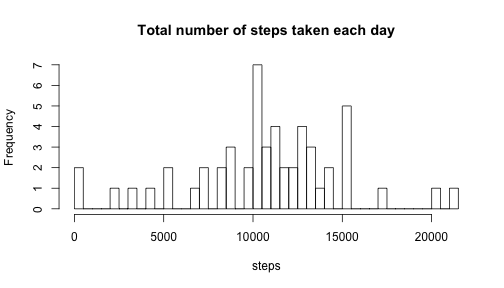
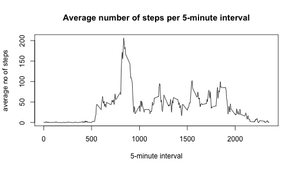
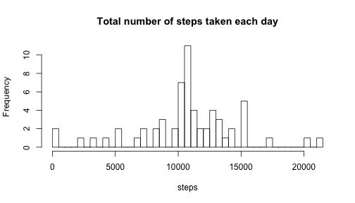
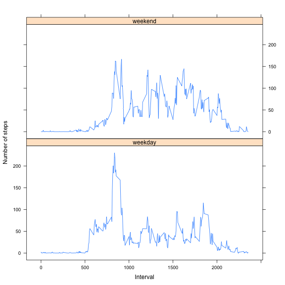

## Loading and preprocessing the data
####Loading the raw data.

```r
rawData <- read.csv("activity.csv", stringsAsFactors = FALSE)
```
####Preprocessing the raw data.
Printing out some information about `rawData`.

```r
summary(rawData)
```

```
##      steps            date              interval     
##  Min.   :  0.00   Length:17568       Min.   :   0.0  
##  1st Qu.:  0.00   Class :character   1st Qu.: 588.8  
##  Median :  0.00   Mode  :character   Median :1177.5  
##  Mean   : 37.38                      Mean   :1177.5  
##  3rd Qu.: 12.00                      3rd Qu.:1766.2  
##  Max.   :806.00                      Max.   :2355.0  
##  NA's   :2304
```
Checking the type of features in `rawData`.

```r
class(rawData$steps)
## [1] "integer"
class(rawData$date)
## [1] "character"
class(rawData$interval)
## [1] "integer"
```
Transforming the `rawData$date` feature from a `character` format to a `Date` format.

```r
rawData$date <- as.Date(rawData$date)
class(rawData$date)
## [1] "Date"
```

## What is mean total number of steps taken per day?
####Calculating the total number of steps taken per day
Such claculation is done using the `aggregate` function (ignoring missing values).

```r
stepsPerDay  <- aggregate(steps ~ date, data=rawData, sum, na.action = na.omit)
head(stepsPerDay)
```

```
##         date steps
## 1 2012-10-02   126
## 2 2012-10-03 11352
## 3 2012-10-04 12116
## 4 2012-10-05 13294
## 5 2012-10-06 15420
## 6 2012-10-07 11015
```
####Make an histogram of the total number of steps taken each day.

```r
hist(stepsPerDay$steps, breaks=50, main="Total number of steps taken each day", xlab = "steps")
```

 


####Calculate and report the mean and median of the total number of steps taken per day. 


```r
mean(stepsPerDay$steps)
## [1] 10766.19
median(stepsPerDay$steps)
## [1] 10765
```

## What is the average daily activity pattern?
####Make a time series plot.
Prepare the data calculating the average number of steps taken per interval - averaged across all days (ignoring missing values).

```r
stepsPerInterval  <- aggregate(steps ~ interval, data=rawData, mean, na.action = na.omit)
head(stepsPerInterval)
```

```
##   interval     steps
## 1        0 1.7169811
## 2        5 0.3396226
## 3       10 0.1320755
## 4       15 0.1509434
## 5       20 0.0754717
## 6       25 2.0943396
```
The time series plot  of the 5-minute interval (x-axis) and the average number of steps taken, averaged across all days (y-axis) is shown below.

```r
plot(stepsPerInterval$interval, stepsPerInterval$steps, type = "l", main="Average number of steps per 5-minute interval", xlab="5-minute interval", ylab="average no of steps")
```

 


####Which 5-minute interval, on average across all the days in the dataset, contains the maximum number of steps? 

It is the interval __835__ with __206.1698113__ steps.


```r
stepsPerInterval[which.max(stepsPerInterval$steps),]
##     interval    steps
## 104      835 206.1698
```

## Imputing missing values
####Calculate and report the total number of missing values in the dataset (i.e. the total number of rows with NAs).

An oveview of such infomrtiona can be given using the `summary` function on the raw data. One information provided is if a feature and its measurements contains NAs and the number of NAs.

```r
summary(rawData)
```

```
##      steps             date               interval     
##  Min.   :  0.00   Min.   :2012-10-01   Min.   :   0.0  
##  1st Qu.:  0.00   1st Qu.:2012-10-16   1st Qu.: 588.8  
##  Median :  0.00   Median :2012-10-31   Median :1177.5  
##  Mean   : 37.38   Mean   :2012-10-31   Mean   :1177.5  
##  3rd Qu.: 12.00   3rd Qu.:2012-11-15   3rd Qu.:1766.2  
##  Max.   :806.00   Max.   :2012-11-30   Max.   :2355.0  
##  NA's   :2304
```
We can see that steps is the only feature having NAs - specifically there are 2304 NAs.

Another way to calculate the number of NAs can be found below.

```r
noOfNAs <- sum(is.na(rawData))
noOfNAs
```

```
## [1] 2304
```
####Devise a strategy for filling in all of the missing values in the dataset. 
One possible strategy is to use the mean of the number of steps calculated for the same 5-minutes interval - averaged across al days for all of the available measurements ignoring the NAs for such calculation.

####Create a new dataset that is equal to the original dataset but with the missing data filled in.
Creating the dataset containg the mean of the number of steps calculated for the same 5-minutes interval - averaged across al days for all of the available measurements ignoring the NAs for such calculation.

```r
stepsPerInterval  <- aggregate(steps ~ interval, data=rawData, mean, na.action = na.omit)
```
Checking which feature/ columns in the raw dataset contain NAs.

```r
any(is.na(rawData$steps))
## [1] TRUE
any(is.na(rawData$date))
## [1] FALSE
any(is.na(rawData$interval))
## [1] FALSE
```
We can see that `steps` is the only feature/ measurement having NAs. 
Replacing the NAs in `steps` with the mean of the number of steps calculated for the same 5-minutes interval in a new dataset `rawDataNoNAs`.

```r
rawDataNoNAs <- rawData
stepsNAsIdx <- which(is.na(rawDataNoNAs$steps))
for (i in stepsNAsIdx){
    j <- rawDataNoNAs$interval[i]
    value <- stepsPerInterval$steps[which(stepsPerInterval$interval == j)]
    rawDataNoNAs$steps[i] <- value
}
```
Verify that there are no more NAs in `rawDataNoNAs`.

```r
summary(rawDataNoNAs)
##      steps             date               interval     
##  Min.   :  0.00   Min.   :2012-10-01   Min.   :   0.0  
##  1st Qu.:  0.00   1st Qu.:2012-10-16   1st Qu.: 588.8  
##  Median :  0.00   Median :2012-10-31   Median :1177.5  
##  Mean   : 37.38   Mean   :2012-10-31   Mean   :1177.5  
##  3rd Qu.: 27.00   3rd Qu.:2012-11-15   3rd Qu.:1766.2  
##  Max.   :806.00   Max.   :2012-11-30   Max.   :2355.0
head(rawDataNoNAs)
##       steps       date interval
## 1 1.7169811 2012-10-01        0
## 2 0.3396226 2012-10-01        5
## 3 0.1320755 2012-10-01       10
## 4 0.1509434 2012-10-01       15
## 5 0.0754717 2012-10-01       20
## 6 2.0943396 2012-10-01       25
```

####Make a histogram of the total number of steps taken each day.

```r
stepsPerDayNoNAs  <- aggregate(steps ~ date, data=rawDataNoNAs, sum, na.action = na.omit)
hist(stepsPerDayNoNAs$steps, breaks=50, main="Total number of steps taken each day", xlab = "steps")
```

 

####Calculate and report the mean and median total number of steps taken per day. 

```r
mean(stepsPerDayNoNAs$steps)
## [1] 10766.19
median(stepsPerDayNoNAs$steps)
## [1] 10766.19
```

####Do these values differ from the estimates from the first part of the assignment? 
All of the missing days has been replaced with the mean of the number of steps taken per day (calculated omitting the NAs).

####What is the impact of imputing missing data on the estimates of the total daily number of steps?
Mean is unchanged - having exactly added the mean of the number of steps taken per day for the missing days. And as a consequence the median is moving towards the mean.

## Are there differences in activity patterns between weekdays and weekends?
####Create a new factor variable in the dataset
Create a new factor variable in the dataset with two levels – “weekday” and “weekend” indicating whether a given date is a weekday or weekend day, using the `rawDataNoNAs` dataset.

```r
rawDataNoNAs$weekday <- weekdays(rawDataNoNAs$date, TRUE)
rawDataNoNAs$isweekend <- as.numeric(rawDataNoNAs$weekday == "Sat" | rawDataNoNAs$weekday == "Sun")
rawDataNoNAs$typeOfDay <- factor(rawDataNoNAs$isweekend)
levels(rawDataNoNAs$typeOfDay) <- c("weekday", "weekend")
```
Structure of the `rawNoNAs`dataset is summarized here below. As we can see a new feature `typeOfDay` has been introduced to indicate if the given day is a week day or not as a `factor`with e levels `weekday`and `weekend`.

```r
summary(rawDataNoNAs)
##      steps             date               interval        weekday         
##  Min.   :  0.00   Min.   :2012-10-01   Min.   :   0.0   Length:17568      
##  1st Qu.:  0.00   1st Qu.:2012-10-16   1st Qu.: 588.8   Class :character  
##  Median :  0.00   Median :2012-10-31   Median :1177.5   Mode  :character  
##  Mean   : 37.38   Mean   :2012-10-31   Mean   :1177.5                     
##  3rd Qu.: 27.00   3rd Qu.:2012-11-15   3rd Qu.:1766.2                     
##  Max.   :806.00   Max.   :2012-11-30   Max.   :2355.0                     
##    isweekend        typeOfDay    
##  Min.   :0.0000   weekday:12960  
##  1st Qu.:0.0000   weekend: 4608  
##  Median :0.0000                  
##  Mean   :0.2623                  
##  3rd Qu.:1.0000                  
##  Max.   :1.0000
is.factor((rawDataNoNAs$typeOfDay))
## [1] TRUE
```

####Make a plot
Make a panel plot containing a time series plot (i.e. type = "l") of the 5-minute interval (x-axis) and the average number of steps taken, averaged across all weekday days or weekend days (y-axis).

```r
weekendData <- subset(rawDataNoNAs, rawDataNoNAs$typeOfDay == "weekend")
stepsPerIntervalWeekend  <- aggregate(steps ~ interval, data=weekendData, mean, na.action = na.omit)
weekdayData <- subset(rawDataNoNAs, rawDataNoNAs$typeOfDay == "weekday")
stepsPerIntervalWeekday  <- aggregate(steps ~ interval, data=weekdayData, mean, na.action = na.omit)
stepsPerIntervalWeekend$typeOfDay <- "weekend"
stepsPerIntervalWeekday$typeOfDay <- "weekday"
weekData <- rbind(stepsPerIntervalWeekend, stepsPerIntervalWeekday)
library(lattice)
xyplot(steps ~ interval | typeOfDay, weekData,layout = c(1,2),type = "l", ylab="Number of steps", xlab="Interval")
```

 
